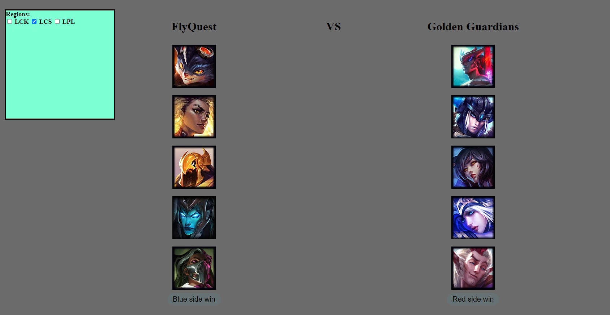

# Lost in Draft

A website that challenges users to guess the outcome of league of legends pro games based on draft alone.

## How it Works

1. Lost in Draft queries the database for a random game
2. Creates a Game() object out of the queried game
3. Displays the data to the user (champion icons, team names, etc.)

At this point, the user will either guess the blue side or the red side to win. Guessing correctly changes the background color to green, while 
guessing incorrectly changes it to red. 

After any guess, Lost in Draft will grab a new game and display it to the user, repeating the process.

## Goals

Everything below is planned to be implemented or is planned to be heavily improved on.

- Options to only show games based on recency
- Check boxes that limit which regions are queried for
- Much better frontend to make the website look better overall
- Support for all official lolesports regions
- Better visual feedback for guessing correctly/incorrectly
- More stats for the individual game after making a guess (every champions' damage that game)
- Showing chosen runes and summoner spells before guessing
